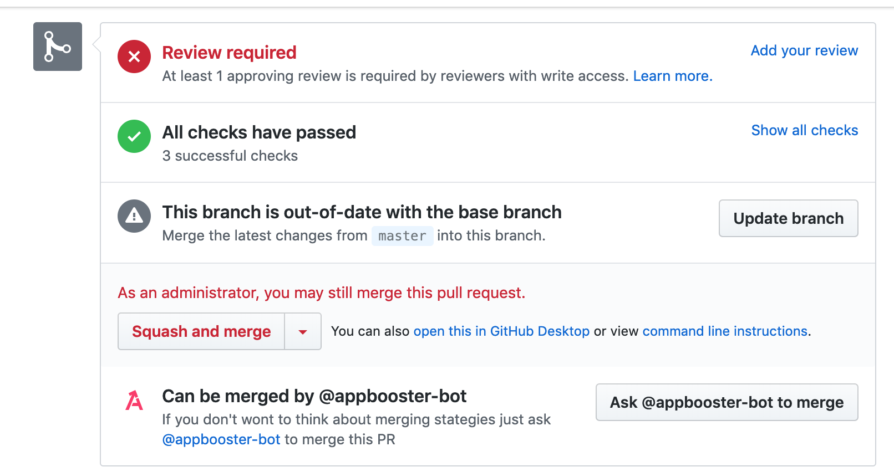
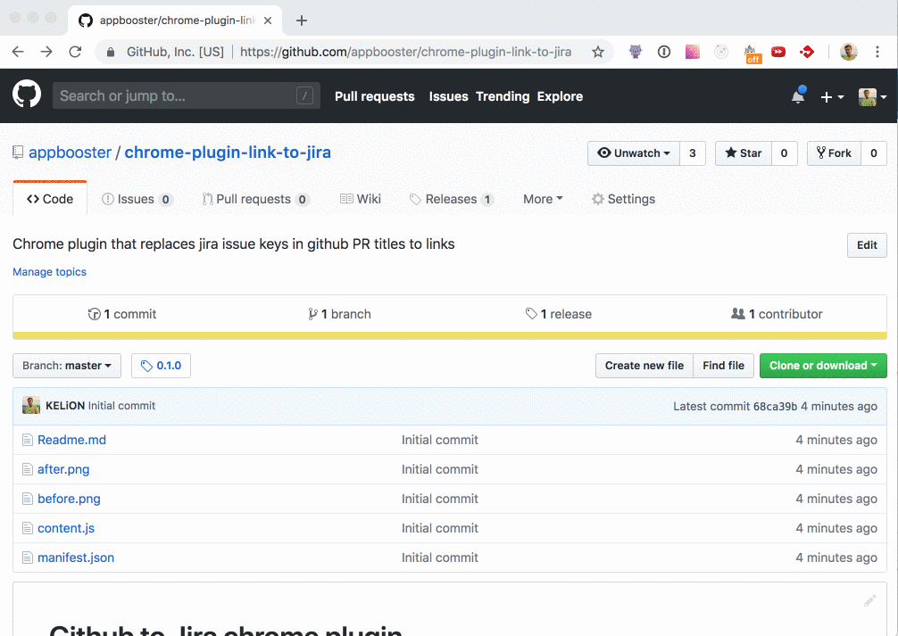

# Browser plugin: ask appbooster bot
Плагин для браузеров, добавляющий функционал для «общения» с ботом @appbooster-bot на гитхабе.

Examples:

## How to install

* Download .crx file from the latest [release](https://github.com/appbooster/chrom-plugin-link-to-jira/)
* Open chrome://extensions
* Drag-n-drop downloaded file to the extensions list

## Releases
Plugin releases hosted on github. To create new release bump plugin version in `manifest.json` and push changes to github. After that create package files

### Chrome
* Open url `chrome://extensions/` and turn on developer mode.
* Select "Pack extension"
* Choose path to your extension in "Extension root directory"
* Choose path to the *.pem private key in "Private key file (optional)"
* Create crx package

### Firefox
* Open plugin directory in terminal
* Run command `zip -r -FS ../github-jira.xpi *`

// TODO: add instruction to release signed xpi
